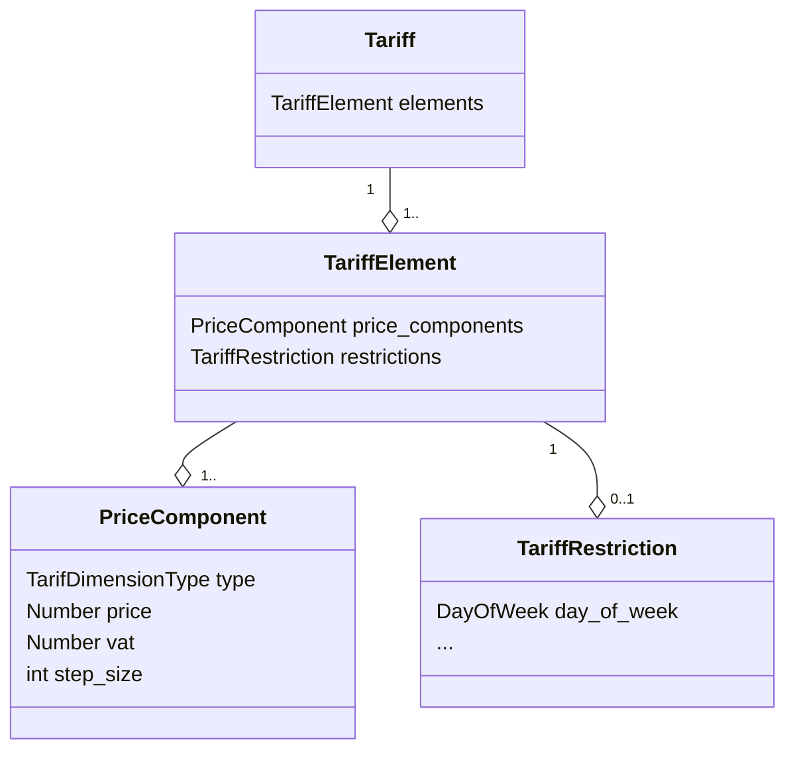

# OCPI tariffs

This project provides software for doing calculations with [OCPI][ocpi]
[tariffs][tariffs]. Specifically for the [`OCPI 2.2.1`](https://evroaming.org/app/uploads/2021/11/OCPI-2.2.1.pdf)
version.

## Goals

- Provide a reference OCPI tariff implementation

  Given a certain
  [CDR](https://github.com/ocpi/ocpi/blob/2.2.1/mod_cdrs.asciidoc) and
  a certain tariff it's able to calculate the different (sub)totals.

  The software provides as output a breakdown of how these (sub)totals were
  calculated.

- Provide an extensive set of test-cases to ensure correctness.

- Collect feedback from the community

  We aim to have as many parties as possible agree that this reference
  implementation is a correct interpretation of the OCPI specification and
  intentions. We aim for close cooperation with the [EV Roaming
  Foundation](https://evroaming.org/).

  We welcome community contributions to this project. We aim to make it easy for
  people, familiar with OCPI, to provide new test cases.

- Provide the software as open source software so others can freely use and
  test it.

  Both a command line tool and a Rust library are provided.

- Expose the software functionality at [OCPI Tools](https://ocpi-tools.com/)
  to make it even easier for people to do calculations with the tariff
  software.

- Support OCPI 3 tariffs soon after OCPI 3 is finalized.

## Non-goals

- Provide software which communicates tariffs using the OCPI protocol between
  EV roaming parties.

- Produce human consumable receipts which specify the different cost components
  that led to the calculated total price.

- Support OCPI version 2.1.1

  The tariff structure of version 2.1.1 is (mostly?) a subset of the structure
  of 2.2.1 so in practise we expect this project to also be usable on 2.1.1.

## Tariff structure overview

## Contributing

We welcome community contributions to this project.

Please read our [Contributor Terms](CONTRIBUTING.md#contributor-terms) before
you make any contributions.

Any contribution intentionally submitted for inclusion, shall comply with the
Rust standard licensing model (MIT OR Apache 2.0) and therefore be dual licensed
as described below, without any additional terms or conditions:

### License

This contribution is dual licensed under EITHER OF

- Apache License, Version 2.0, ([LICENSE-APACHE](LICENSE-APACHE) or <http://www.apache.org/licenses/LICENSE-2.0>)
- MIT license ([LICENSE-MIT](LICENSE-MIT) or <http://opensource.org/licenses/MIT>)

at your option.

For clarity, "your" refers to TandemDrive or any other licensee/user of the contribution.

[ocpi]: https://evroaming.org/ocpi-background/
[ocpi-gh]: https://github.com/ocpi/ocpi
[tariffs]: https://github.com/ocpi/ocpi/blob/2.2.1/mod_tariffs.asciidoc#1-tariffs-module
